# DINOSAR
## <ins>DINO</ins>v3 <ins>S</ins>pecies <ins>A</ins>uto-<ins>R</ins>ecovery (Zero-Shot AI Enabled Morphological Species Delimitaiton) 

DINOSAR uses self-supervised pre-training for zero-shot learning **DINOv3 ViTs** to compare two specimen photos without any training. It builds foreground-aware, attention-weighted patch similarities and (optionally) a **thin-plate spline (TPS) homologous grid** from COCO-format keypoints to compare like-with-like regions. Outputs include robust dissimilarity histograms, attention overlays, sparse correspondences, and TPS grid overlays (below).
Eg. Colpoptera fusca x Colpoptera maculata
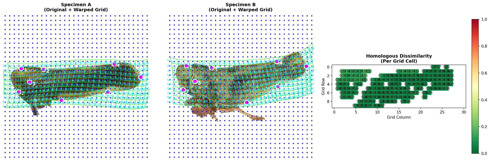

Built around `DINOV3_patch_match_v_76_edge_suppression.py`. CLI options cited below come straight from the script.

---

## Features

- **Layer sweep & fusion**: extract tokens from multiple ViT layers (e.g. `-3 -2 -1`) and fuse by mean/median for stability. 
- **Foreground & edge suppression**: threshold by foreground *and* drop N border patch rings; optional erosion; optional attention∩foreground gating. 
- **Two sparse-match flavors**  
  - **Attention**: rank & match by attention importance.  
  - **Demo**: DINOv3-notebook style mutual/ratio matching with optional RANSAC verification. 
- **Multiple histogram/score modes**: `foreground`, `attention_weighted`, `demo_inliers`, `bidirectional`, `topk_mean`.
- **TPS homology mode** *(optional)*: COCO keypoints → consensus shape → TPS warps → homologous grid cells → per-cell dissimilarities + overlays. 
- **Run metadata** saved as YAML for reproducibility. 
---
## Informative sample <--to--> sample, attention dissimilarity mapping
Colpoptera fusca x Colpoptera maculata
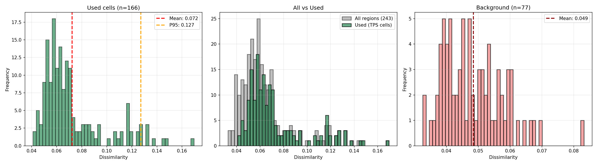
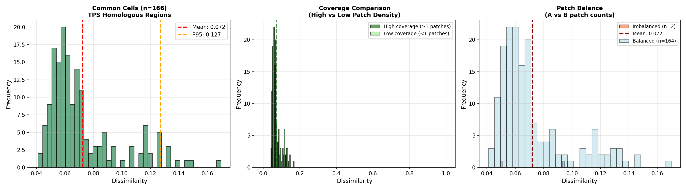
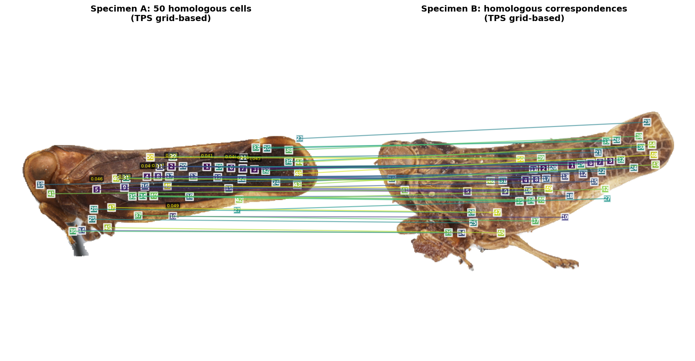

Colpoptera fusca x Colpoptera fusca
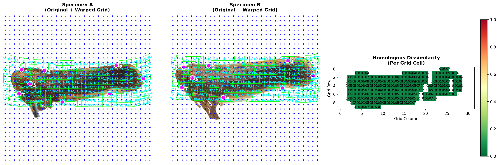
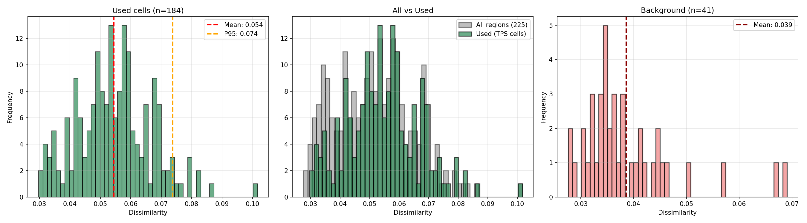
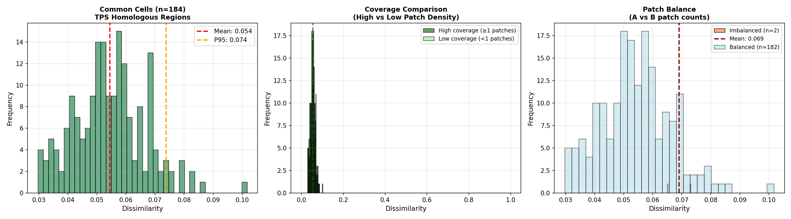
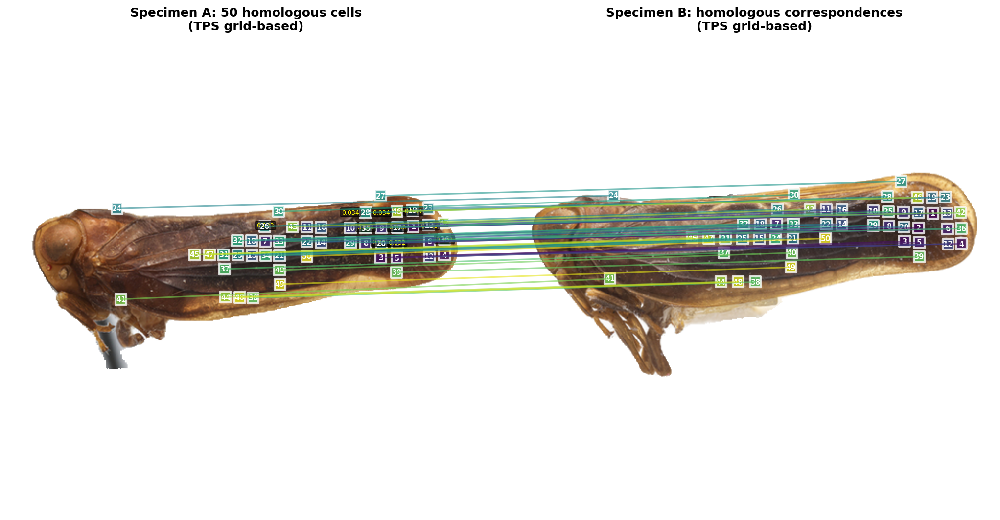

Colpoptera DINOv3 Attention maps
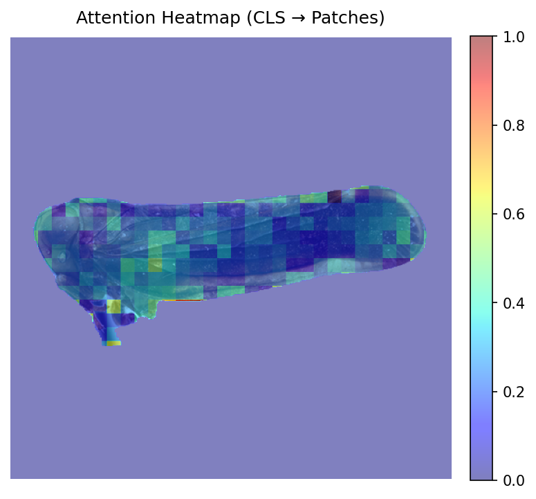
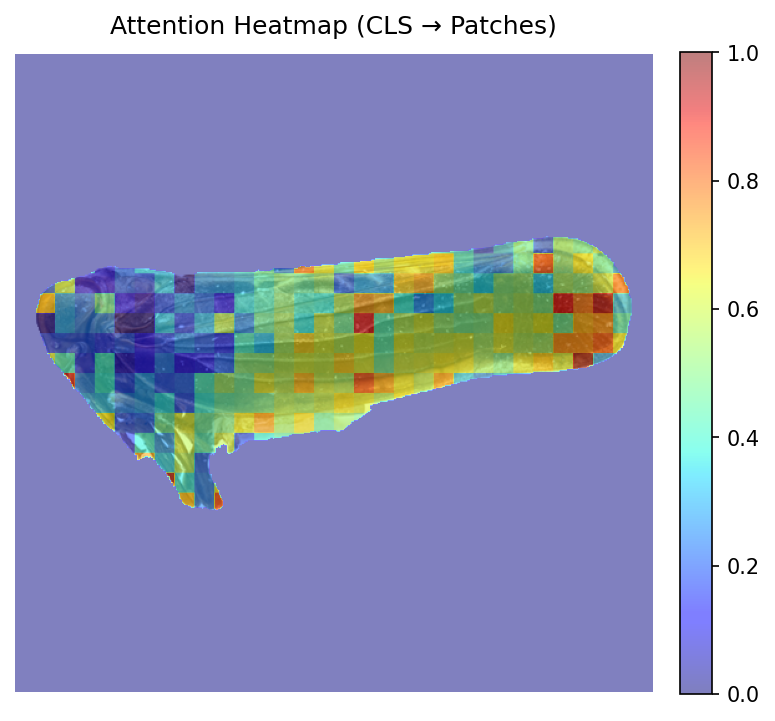


---

## Installation

### 1) Create a conda env (recommended)

```bash
conda env create -f environment.yml
conda activate dinosar
```


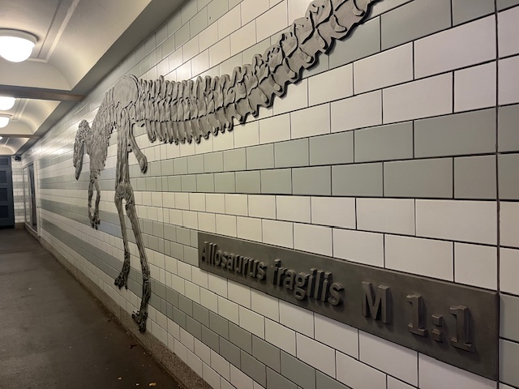


